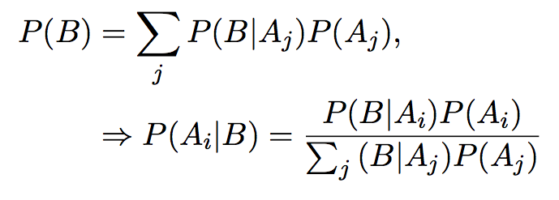

*Due Thursday, 08 October, 1:00 PM*

50 points total.

### Question 1 ###

**10 points**

1. Use GitHub to turn in the first three homework assignments. Make sure the teacher (couthcommander) and TA (trippcm) are collaborators. (5 points)

2. Commit each assignment individually.  This means your repository should have at least three commits. (5 points)

### Question 2 ###

**15 points**

Write a simulation to calculate the power for the following study
design.  The study has two variables, treatment group and outcome.
There are two treatment groups (0, 1) and they should be assigned
randomly with equal probability.  The outcome should be a random normal
variable with a mean of 60 and standard deviation of 20.  If a patient
is in the treatment group, add 5 to the outcome.  5 is the true
treatment effect.  Create a linear of model for the outcome by the
treatment group, and extract the p-value (hint: see assigment1).
Test if the p-value is less than or equal to the alpha level, which
should be set to 0.05.

Repeat this procedure 1000 times. The power is calculated by finding
the percentage of times the p-value is less than or equal to the alpha
level.  Use the `set.seed` command so that the professor can reproduce
your results.

1. Find the power when the sample size is 100 patients. (10 points)

```{r}
set.seed(7)
powerTest <- function(n, trials, alpha = 0.05) {
  powerTally <- rep(0, trials)
  for (i in 1:trials) {
    treatment <- rbinom(n,1,0.5)
    outcome <- rnorm(n,60,20)
    for (patient in 1:n){
      if (treatment[patient] == 1) {
        outcome[patient] <- outcome[patient] + 5
      }
    }
    pval <- summary(lm(outcome ~ treatment))$coefficients[2,4]
    if (pval <= alpha) powerTally[i] <- 1
  }
  return(sum(powerTally)/trials)
}
powerTest(100,1000)
```

2. Find the power when the sample size is 1000 patients. (5 points)

```{r}
powerTest(1000,1000)
```

### Question 3 ###

**15 points**

Obtain a copy of the [football-values lecture](https://github.com/couthcommander/football-values).
Save the `2015/proj_rb15.csv` file in your working directory.  Read
in the data set and remove the first two columns.

1. Show the correlation matrix of this data set. (3 points)

```{r}
football <- read.csv('proj_rb15.csv')
football <- football[ ,3:9]
(corFootball <- cor(football))
```

1. Generate a data set with 30 rows that has a similar correlation
structure.  Repeat the procedure 10,000 times and return the mean
correlation matrix. (10 points)

```{r}
library(MASS)
varFootball <- var(football)
meanFootball <- colMeans(football)

corAvg <- 0
sims <- 10000
for(i in 1:sims) {
  dataSim <- mvrnorm(30, mu=meanFootball, Sigma=varFootball)
  corAvg <- corAvg + cor(dataSim)/sims
}
corAvg # The simulated correlation matrix
corFootball # The actual correlation matrix
```

2. Generate a data set with 30 rows that has the exact correlation
structure as the original data set. (2 points)

```{r}
exact <- mvrnorm(30, mu=meanFootball, Sigma=varFootball, empirical=T)
```

### Question 4 ###

**10 points**

Use \LaTeX to create the following expressions.

1. Hint: `\Rightarrow` (4 points)

    
    
\[
P(B) = \sum_{j} P(B | A_j) P(A_j), \Rightarrow P(A_i | B) = \frac{P(B | A_i) P(A_i)}{\sum_{j} (B | A_j) P(A_j)}\
\]

1. Hint: `\zeta` (3 points)

    
    
\[
\hat{f}(\zeta) = \int_{-\infty}^\infty f(x) e^{-2 \pi ix \zeta} \, dx
\]

1. Hint: `\partial` (3 points)

    
    
\[
\mathbf{J} = \frac{d \mathbf{f}}{d \mathbf{x}} = \begin{bmatrix}
    \frac{\partial \mathbf{f}}{\partial x_{1}}  & \cdots & \frac{\partial \mathbf{f}}{\partial x_{2}}
\end{bmatrix} = \begin{bmatrix} \frac{\partial f_{1}}{\partial x_{1}} & \cdots & \frac{\partial f_{1}}{\partial x_{n}} \\ \vdots & \ddots & \vdots \\ \frac{\partial f_{m}}{\partial x_{1}} & \cdots & \frac{\partial f_{m}}{\partial x_{n}} \end{bmatrix}
\]
